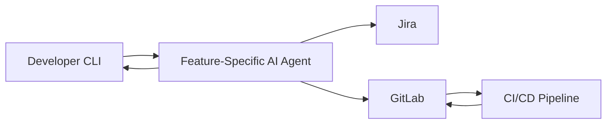

# atella-ai

## AI Delivery Automation • Agent Architectures • Enterprise Software Engineering

This repository documents **architecture patterns, design approaches, and concepts** for building **AI-driven systems** in real-world enterprise environments — spanning both **internal engineering automation** and **customer-facing AI applications**.

I’m a senior software engineer with **20+ years of experience**. Over the past year, my work has focused on designing and implementing **production-grade AI agent systems** that integrate directly with existing workflows to reduce cycle time, coordination overhead, and long-term maintenance cost.

---

## Why There Is No Public Code

Most of the systems I build are:
- **Client-specific**
- **Production-grade**
- **Proprietary and confidential**

As a result, this repository intentionally does **not** contain full implementation code.

Instead, it serves as:
- A reference for **architecture decisions**
- A place to document **design patterns and trade-offs**
- A way to explain **how AI is applied responsibly in enterprise settings**

This is deliberate and by design.

---

## What I Build (Conceptually)

### 1. AI Delivery Automation (Internal Engineering)

I design **CLI-based AI agents** that integrate directly into developer workflows to automate and accelerate software delivery.

**Key patterns:**
- **One agent per feature**
  - Isolated responsibility
  - Easier enhancements without regressions
  - Avoids monolithic agent designs
- **Developer-native workflows**
  - CLI-first
  - Integrated into existing tooling, not layered on top

**Integrations:**
- **Jira**
  - Automated ticket context ingestion
  - Status updates and traceability
  - Reduced manual coordination
- **GitLab**
  - Code context awareness
  - Merge request orchestration
  - Deployment automation

---

### High-Level Architecture — AI Delivery Automation

